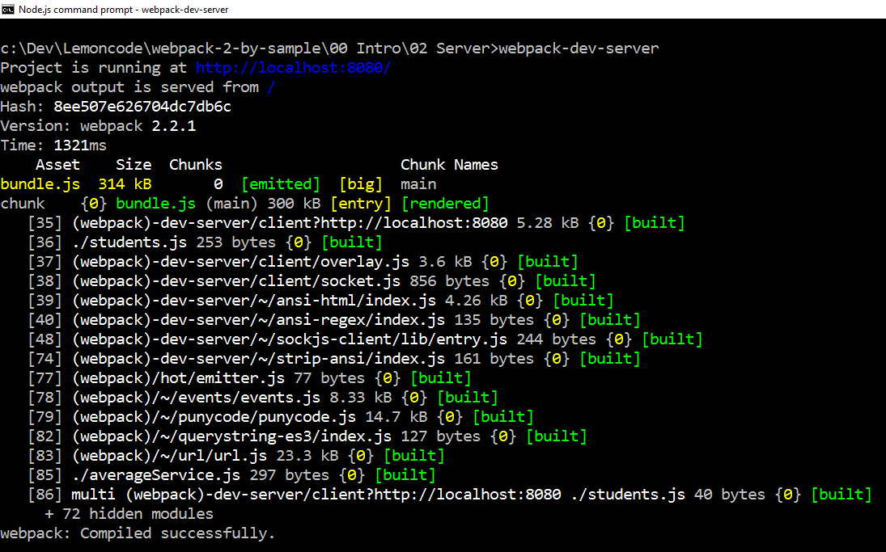

# 02 Server

In this sample we are going to enter into "dev mode". Working with files service
is not ideal when you are developing a web application, we will learn how to launch
a lite web server, how deploy our bundle into a dist folder (including index.html)
, how to debug our es6 code directly into the browser debugger and minify
our bundle.js.

We will start from sample _00 Intro/01 Import_, install `webpack-dev-server`, setup our config
to deploy on config folder and support maps (debug), then we will minify
our bundle.js file via webpack cli params.

Summary steps:
 - Install via npm webpack-dev-server.
 - Execute webpack-dev-server with live reload.
 - Add start command to package.json.

# Steps to build it

## Prerequisites

Prerequisites, you will need to have nodejs installed in your computer. If you want to follow this step guides you will need to take as starting point sample _01 Import_.

## steps

- `npm install` to install previous sample packages:

```
npm install
```

- Let's install `webpack-dev-server`, this package ships with a lite server that we
can use as dev web server. This time we'll install this package as a global dependency (note down the "-g" param).

```
npm install webpack -g
npm install webpack-dev-server -g
```

- Now we can directly execute from the command prompt `webpack-dev-server`, this
will launch our web dev server, in this case in port 8080.



- If we open a browser we can point the url to http://localhost:8080 and we will browse our web app.


- One interesting feature that ships this dev server is **live reloading**, thus any changes introduced in any of the JavaScript files will be automatically detected and webpack dev server will launch the build process and once finished automatically refresh the page being display in the browser. In order to do this we don't need to do anything.

- We don't need to remember this params every time we want to launch our dev
server, in order to avoid this we can just add a `start` script to our `package.json` file.

### ./package.json
```diff
{
  ...
  "scripts": {
-   "start": "webpack"
+   "start": "webpack-dev-server"
  },
  ...
}

```

- Once we have saved this change we can directly execute from the command prompt:

```
npm start
```

- Now that we are using this approach, we don't need `webpack-dev-server` globally installed. In order to uninstall `webpack-dev-server` globally, execute the next command (note down the "-g" param):

```
npm uninstall webpack-dev-server -g
```

-  We could just install it at project level, stop it and then use `npm start` to launch it again:

```
npm install webpack-dev-server --save-dev
```

And we will get our dev server up and running.

- Finally, we can configure this server in _webpack.config.js_:

### ./webpack.config.js
```diff
module.exports = {
  entry: ['./students.js'],
  output: {
    filename: 'bundle.js',
  },
  module: {
    rules: [
      {
        test: /\.js$/,
        exclude: /node_modules/,
        loader: 'babel-loader',
      },
    ],
  },
+ devServer: {
+   port: 8081,
+ },
};

```

- Now, it's running on 8081 port.

- We can restore default port:

### ./webpack.config.js
```diff
module.exports = {
  entry: ['./students.js'],
  output: {
    filename: 'bundle.js',
  },
  module: {
    rules: [
      {
        test: /\.js$/,
        exclude: /node_modules/,
        loader: 'babel-loader',
      },
    ],
  },
  devServer: {
-   port: 8081,
+   port: 8080,
  },
};

```
