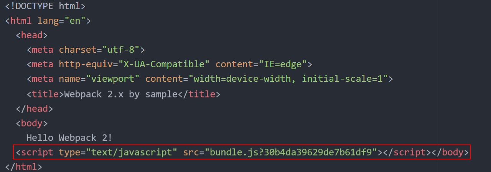
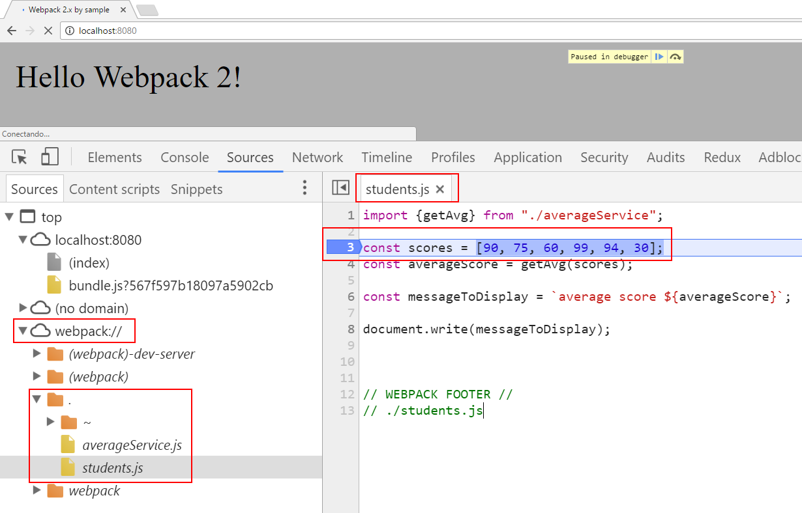

# 03 Output

In this sample we are going to setup a distribution folder where the webpack bundle and
main HTML page will be copied to.

We will start from sample _00 Intro/02 Server_,

Summary steps:
 - Redirect output (bundle.js) to "dist" folder.
 - Include into the build proccess: copying the index.html file to "dist" folder
 - Let webpack include the bundle.js script into the index.html file.
 - Add map support in order to enable ES6 files to be debugged directly on the browser.
 - Generate a minified version of the bundle.js.

# Steps to build it

## Prerequisites

You will need to have nodejs installed in your computer. If you want to follow this step-by-step guide you will need to take as starting point sample _00 Intro/02 Server_.

## steps

- `npm install` to install previous sample packages:

```
npm install
```

- It's not a good idea to mix source code with generated one (bundle), ideally this generated code should be placed under a separate folder (let's name it dist). In order to setup this we have to indicate webpack the output folder. First we will require the "path" package on top of our `webpack.config.js` file just to get some helpers to manipulate paths. We will also create a member variable that will hold the basePath (current path where webpack.config is being placed):

### ./webpack.config.js
```diff
+ var path = require('path');

+ var basePath = __dirname;

module.exports = {
  entry: ['./students.js'],
...

```

- Then under the output section we will add a new parameter called path and we will add a new parameter indicating that the ouput path will be current path + "/dist". Now we can execute `webpack` and check that the bundle output is generated under the dist folder.

### ./webpack.config.js
```diff
...
module.exports = {
  entry: ['./students.js'],
  output: {
+   path: path.join(basePath, 'dist'),
    filename: 'bundle.js',
  },
  ...
```

- We have the js file under the dist folder, wouldn't it be nice to include the index.html into that folder? And what's more, wouldn't it be great if didn't need to manually inject the script tag pointing to the bundle.js file, and let webpack do that for us? (including a hash param to avoid browser caching when new versions are being deployed).

- In order to do that we are going to introduce the concept of [webpack plugin](https://webpack.js.org/configuration/plugins/): plugins allow us to inject custom build steps. Meanwhile loaders (e.g. babel-loader) act file by file (files that match the given extension e.g. js, or ts...), plugins act globally and are executed once. We are going to install a plugin called [html-webpack-plugin](https://github.com/ampedandwired/html-webpack-plugin). In the command prompt, type:

```
npm install html-webpack-plugin --save-dev
```

- Let's remove from our base index.html the script tag:

### ./index.html
```diff
<!DOCTYPE html>
<html lang="en">
  <head>
    <meta charset="utf-8">
    <meta http-equiv="X-UA-Compatible" content="IE=edge">
    <meta name="viewport" content="width=device-width, initial-scale=1">
    <title>Webpack 2.x by sample</title>
  </head>
  <body>
    Hello Webpack 2!
-   <script src="bundle.js"></script>
  </body>
</html>

```

- This plugin (html-webpack-plugin) will take as template input our index.html, and we will point an output destination (index.html under dist folder). The plugin will copy index.html into destination and inject the script tag including a hash tag to avoid browser caching when new versions are being deployed. Once we have installed it, we need to require it on top of our webpack.config.js file:

### ./webpack.config.js
```diff
var path = require('path');
+ var HtmlWebpackPlugin = require('html-webpack-plugin');

var basePath = __dirname;

module.exports = {
  entry: ['./students.js'],
  ...

```

- In order to configure it we have to add the following section
on our webpack.config.js (right after modules definition).

### ./webpack.config.js
```diff
...
module.exports = {
  ...
  devServer: {
    port: 8080,
  },
+ plugins: [
+   //Generate index.html in /dist => https://github.com/ampedandwired/html-webpack-plugin
+   new HtmlWebpackPlugin({
+     filename: 'index.html', //Name of file in ./dist/
+     template: 'index.html', //Name of template in ./src
    }),
  ],
};
```


- Now if we run webpack we will realize that index.html is copied under the dist folder and the script tag is automatically being generated. There is only one caveat... we are not getting any additional hash param to avoid browser caching, we can do that by setting the option hash to true:

### ./webpack.config.js
```diff
...
module.exports = {
  ...
  devServer: {
    port: 8080,
  },
  plugins: [
    //Generate index.html in /dist => https://github.com/ampedandwired/html-webpack-plugin
    new HtmlWebpackPlugin({
      filename: 'index.html', //Name of file in ./dist/
      template: 'index.html', //Name of template in ./src
+     hash: true,
    }),
  ],
};
```




- This looks quite well but... we are developers. What would happen if we attempt to debug our web app from the browser? By default we only will be able to debug bundle.js (big file already transpiled to es5), if we need to pinpoint issues and debug step by step this is far from ideal. Is there a way to let the browser link our original files and let us debug directly on es6 mode? The answer is yes, we only need to add a line of code to our `webpack.config` configuration, right after `output` closing curly bracket:

### ./webpack.config.js
```diff
...
module.exports = {
  ...
+ // For development https://webpack.js.org/configuration/devtool/#for-development
+ devtool: 'inline-source-map',
  devServer: {
    port: 8080,
  },
  ...

```

Now if you just start our web server again (npm start) and open the developer tab we will be
able to browse our original es6 files and place breakpoints / debug.



- Just to wrap up... a mandatory step on any web app is to minify / obsfuscate the JavaScript files. In order to do that we only need to call webpack adding the param -p

```
webpack -p
```

If we open the generated bundle.js file we will realize that the new version has been minified.


