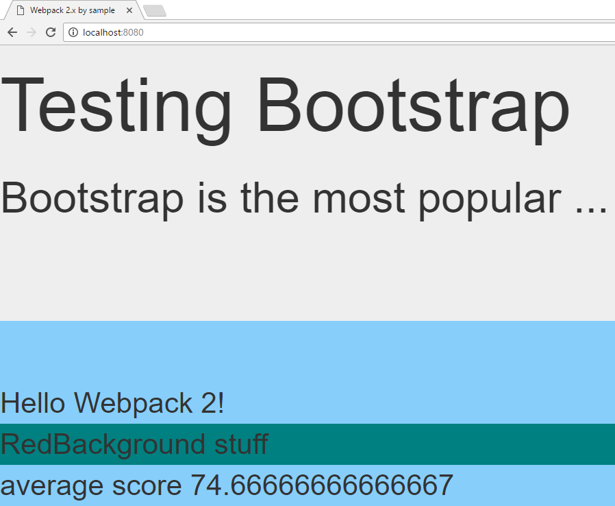
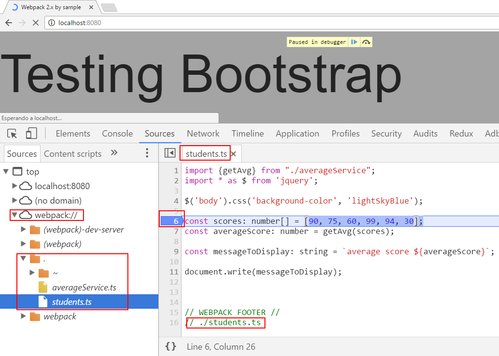

# 00 TypeScript

In this demo we will add support for TypeScript.

We will start from sample _01 Styles/03 SASS_, install TypeScript locally,
configure a tsconfig file, add some ts like, install awesome-typescript-loader and apply it to webpackconfig.

Summary steps:
 - Remove babel configuration.
 - Install TypeScript as a local dependency.
 - Configure TypeScript for our project (tsconfig)
 - Port our project to TypeScript and add use in our code some of the ts features.
 - Install [awesome-typescript-loader](https://github.com/s-panferov/awesome-typescript-loader).
 - Add the proper configuration in webpack.config.js

# Steps to build it

## Prerequisites

Prerequisites, you will need to have nodejs installed in your computer. If you want to follow this step guides you will need to take as starting point sample _03 SASS_.

## steps

- `npm install` to install previous sample packages:

```
npm install
```

- Before install or configuring any TypeScript stuff, we are going to uninstall and remove babel configuration:

```
npm uninstall babel-core babel-loader babel-preset-env --save-dev
```

- Remove `.babelrc`.

- TypeScript is a nice superset of JavaScript that allows static typings amongst other interesting features. All the code we type in TypeScript will not run on the browser, so we need to transpile it. Let's start by installing TypeScript locally(\*).

```
npm install typescript --save-dev
```

_(*) Why installing TypeScript locally and not globally? By installing it locally the project does not depend on global dependencies and is easier to e.g make build and pass unit tests on a clean CI (Continuous Integration) machine like [Travis](https://travis-ci.org/), [Docker](https://www.docker.com/), [Jenkins](https://jenkins.io/), etc.
Another benefit of installing locally is that we can set up a specific version of TypeScript with no rely on the global version installed on the machine is being executed._

- The next step is to add a TypeScript configuration file, *tsconfig.json*.
In this file will define the settings that we want, e.g to transpile to ES5 amongst others.

```json
{
  "compilerOptions": {
    "target": "es5",
    "module": "commonjs",
    "declaration": false,
    "noImplicitAny": false,
    "sourceMap": true,
    "noLib": false,
    "suppressImplicitAnyIndexErrors": true
  },
  "compileOnSave": false,
  "exclude": [
    "node_modules"
  ]
}

```

- In order to get JQuery intellisense, we can install JQuery typings:

```
npm install @types/jquery --save-dev
```

- Let's port our code to TypeScript, we are going to rename the files *students.js* and *averageService.js* to _students.**ts**_ and _averageService.**ts**_.

- Let's introduce some TypeScript, in *students.ts* we are going to type the
variables we are using:

### ./students.ts
```diff
import {getAvg} from "./averageService";
+ import * as $ from 'jquery';

$('body').css('background-color', 'lightSkyBlue');

- const scores = [90, 75, 60, 99, 94, 30];
+ const scores: number[] = [90, 75, 60, 99, 94, 30];
- const averageScore = getAvg(scores);
+ const averageScore: number = getAvg(scores);

- const messageToDisplay = `average score ${averageScore}`;
+ const messageToDisplay: string = `average score ${averageScore}`;

document.write(messageToDisplay);

```


- Next we'll type our function in *averageService.ts*:

### ./averageService.ts
```diff
- export function getAvg(scores) {
+ export function getAvg(scores): number {
   return getTotalScore(scores) / scores.length;
  }

- function getTotalScore(scores) {
+ function getTotalScore(scores): number {
    return scores.reduce((score, count) => {
      return score + count;
    });
  }

```

- Now it's time to configure *wepback*, let's install a loader that will manage
TypeScript: [awesome-typescript-loader](https://github.com/s-panferov/awesome-typescript-loader).

```
npm install awesome-typescript-loader --save-dev
```

- Let's update *webpack.config.js* in order to use this loader on **ts** extension files and in order to avoid having to add the extensions to the ts imports we can just add it to the array of extensions to be resolved:

```diff
...

module.exports = {
+ resolve: {
+   extensions: ['.js', '.ts'],
+ },
  entry: {
-   app: './students.js',
+   app: './students.ts',
    appStyles: [
      './mystyles.scss',
    ],
    vendor: [
      'jquery',
    ],
    vendorStyles: [
      './node_modules/bootstrap/dist/css/bootstrap.css',
    ],
  },
  output: {
    path: path.join(basePath, 'dist'),
    filename: '[chunkhash].[name].js',
  },
  module: {
    rules: [
      {
-       test: /\.js$/,
+       test: /\.ts$/,
        exclude: /node_modules/,
-       loader: 'babel-loader',
+       loader: 'awesome-typescript-loader',
      },
      ...
    ],
  },
  ...
};

```

- If we run the app (`npm start`) we can check that everything is working as expected.



- If we open browser console we can access to `.ts` files and add breakpoints thanks to previous `sourceMap` configuration:

### ./tsconfig.json
```javascript
{
  "compilerOptions": {
    ...
    "sourceMap": true,
    ...
  },
  ...
}

```

### ./webpack.config.js
```javascript
...
  // For development https://webpack.js.org/configuration/devtool/#for-development
  devtool: 'inline-source-map',
  ...

```


