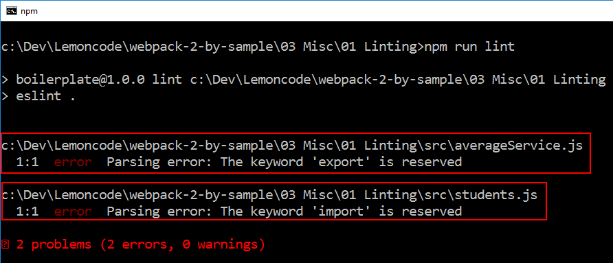
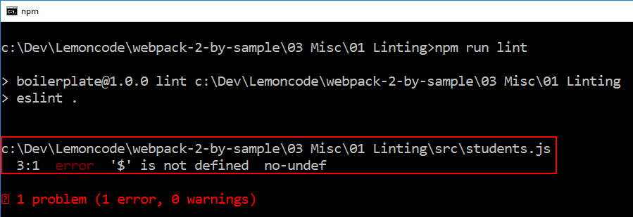
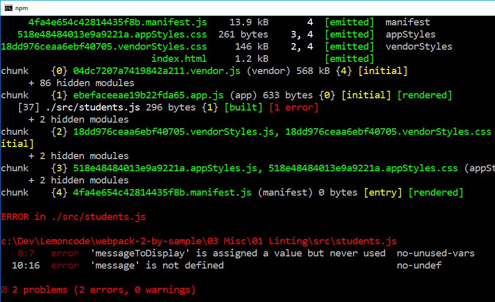
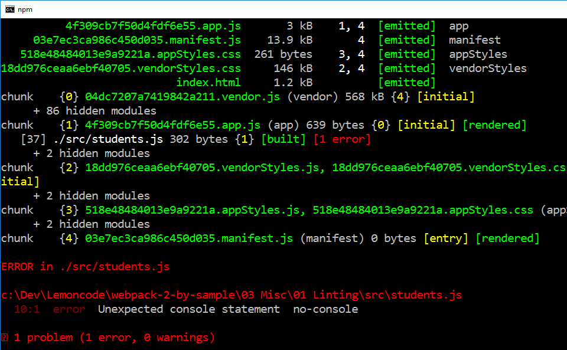
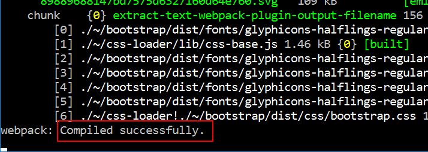
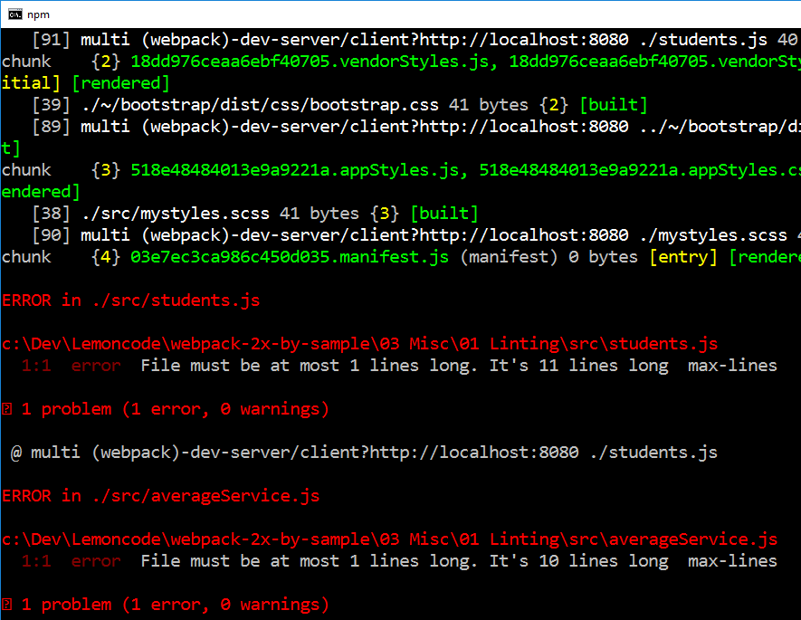

# 01 Linting

In this sample we are going to introduce Linting. This is a technique which you can analyse code for potential errors, so that can help you to make less mistakes.

We will start from sample _01 Styles/03 SASS_.

Summary steps:
 - Installing ESLint.
 - Configuring ESLint.
 - Connecting with Babel.
 - Connecting with Webpack.
 - Adding custom rules.

# Steps to build it

## Prerequisites

Prerequisites, you will need to have nodejs installed in your computer. If you want to follow this step guides you will need to take as starting point sample _03 SASS_.

## steps

- `npm install` to install previous sample packages:

```
npm install
```

- [ESLint](http://eslint.org/) is the newest tool for _linting_ that goes to the next level and it allows us to use custom rules, parsers, plugins, etc.
Let's start by downloading the `eslint` library via `npm`:

```
npm install eslint --save-dev
```

- ESLint works with Babel and JSX syntax by installing plugins. That is, it's a great library to develop React projects. This sample is a demo, so come on to implement a basic configuration.
We are going to create a file `.eslintrc.json` (there are many [file formats options](http://eslint.org/docs/user-guide/configuring#configuration-file-formats))

### ./.eslintrc.json
```json
{
  "extends": [
    "eslint:recommended"
  ],
  "env": {
    "browser": true,
    "node": true
  }
}

```

- This is the most basic configuration where we are using [defaults rules](http://eslint.org/docs/rules/) provided by ESLint and we are defining [browser and node environmenst](http://eslint.org/docs/user-guide/configuring#specifying-environments) to define `browser` global variables like *window* object and `node` global variables like *require* or *__dirname*.

- We can implement a [npm command script](https://docs.npmjs.com/misc/scripts) to run eslint:

### ./package.json
```diff
{
  ...
  "scripts": {
-   "start": "webpack-dev-server"
+   "start": "webpack-dev-server",
+   "lint": "eslint ."
  },
  ...
}

```

- Executing this command

```
npm run lint
```



- ESLint throws two parse errors due to use _export_ and _import_ keywords. Import and export functionalities are provided by Babel to work with modules. So it's time to connect ESLint with Babel:

```
npm install babel-eslint --save-dev
```

### ./.eslintrc.json
```diff
{
  "extends": [
    "eslint:recommended"
  ],
  "env": {
    "browser": true,
    "node": true
  },
+ "parser": "babel-eslint"
}

```



- As we see, this time `npm run lint` throw a `jquery` errors. To solve this:

### ./.eslintrc.json
```diff
{
  "extends": [
    "eslint:recommended"
  ],
  "env": {
    "browser": true,
-   "node": true
+   "node": true,
+   "jquery": true
  },
  "parser": "babel-eslint"
}

```

- Run `npm run lint`:


- As we see, this time doesn't throw any errors, it sounds good!. But we want to execute ESLint while we are writing our code. That is, the following step is connect ESLint with Webpack.

- We should install `eslint-loader`:

```
npm install eslint-loader --save-dev
```

- To configure Webpack, we're going to use preloader definition. We make sure ESLint parse the code before any other process. We get a _webpack.config.js_ like this:

### ./webpack.config.js
```diff
...

module.exports = {
  ...
  module: {
    rules: [
+     {
+       test: /\.js$/,
+       exclude: /node_modules/,
+       enforce: 'pre',
+       loader: 'eslint-loader',
+     },
      {
        test: /\.js$/,
        exclude: /node_modules/,
        loader: 'babel-loader',
      },
      ...
    ],
  },
  ...
};

```

- Now we can remove previous npm command and execute again `npm start`.

### ./package.json
```diff
{
  ...
  "scripts": {
+   "start": "webpack-dev-server"
-   "start": "webpack-dev-server",
-   "lint": "eslint ."
  },
  ...
}

```

- Naked eye, it looks like nothing happens with the build. Let's go to change the code to introduce a typo:

### ./src/students.js

```diff
import {getAvg} from "./averageService";

$('body').css('background-color', 'lightSkyBlue');

const scores = [90, 75, 60, 99, 94, 30];
const averageScore = getAvg(scores);

const messageToDisplay = `average score ${averageScore}`;

- document.write(messageToDisplay);
+ document.write(message);

```



## Defining Rules

- As we see previously, we are using [ESLint default rules](http://eslint.org/docs/rules/)

### ./.eslintrc.json
```diff
{
  "extends": [
    "eslint:recommended"
  ],
  ...
}

```

- The good news is that we can [configure all of these rules](http://eslint.org/docs/user-guide/configuring#configuring-rules) following these values:

  - `0` o `off` - Disable rule.
  - `1` o `warn` - Turn to warning.
  - `2` o `error` - Turn to error.

- For example, if we change `students.js` to this code:

### ./src/students.js
```diff
import {getAvg} from "./averageService";

$('body').css('background-color', 'lightSkyBlue');

const scores = [90, 75, 60, 99, 94, 30];
const averageScore = getAvg(scores);

const messageToDisplay = `average score ${averageScore}`;

- document.write(message);
+ console.log(messageToDisplay);

```

- As result, we get this error because the use of _console_ is disallow by default.



- We can disable this rule with the following configuration:

### ./.eslintrc.json
```diff
{
  "extends": [
    "eslint:recommended"
  ],
  "env": {
    "browser": true,
    "node": true,
    "jquery": true
  },
- "parser": "babel-eslint"
+ "parser": "babel-eslint",
+ "rules": {
+   "no-console": 0
+ }
}

```



- Other example is rule named [max-lines](http://eslint.org/docs/rules/max-lines) that it _enforces a maximum number of lines per file, in order to aid in maintainability and reduce complexity._

### ./.eslintrc.json
```diff
{
  "extends": [
    "eslint:recommended"
  ],
  "env": {
    "browser": true,
    "node": true,
    "jquery": true
  },
  "parser": "babel-eslint",
  "rules": {
-   "no-console": 0
+   "no-console": 0,
+   "max-lines": ["error", 1]
  }
}

```

_NOTE:_ We can use "error" or 2. But we can read better this line if we use "error" word.



- To integrate tslinter with React based project we can use [eslint-plugin-react](https://www.npmjs.com/package/eslint-plugin-react) that provides linting for JSX language.
